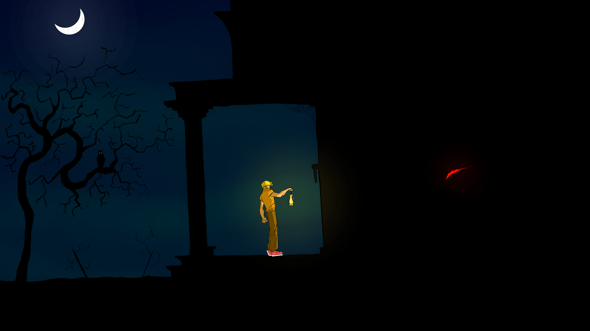

# Bharath Krishnan's Portfolio

# Contents
- [About](#About)
- [Games](#Games)
- [Graphics and Shader Art](#Shaders)
- [Other Projects](#Others)

# About
I am a passionate game developer with over seven years of experience, specializing in Unity Game Engine. I have keen interest in shader art and procedural generation algorithms. Currently, I’m working as a Unity Developer Intern at Fabwelt Studios, where I focus on gameplay programming to bring engaging and innovative game mechanics to life.

In addition to game development, I’m passionate about various creative outlets. I enjoy playing video games, watching anime, reading, and sketching in my spare time, all of which fuel my creativity and inspire my work.

# Games
## 1. [Funky Blueprints](https://bharathk33.itch.io/funkyblueprints)

<iframe width="560" height="315" src="https://www.youtube.com/embed/QuP8OgCKnaM?si=NvZ_nb2nvLji_Woe" title="YouTube video player" frameborder="0" allow="accelerometer; autoplay; clipboard-write; encrypted-media; gyroscope; picture-in-picture; web-share" referrerpolicy="strict-origin-when-cross-origin" allowfullscreen></iframe>

A physics based puzzle game, where you draw different contraptions to carry the heart to its destination. It was made in Godot in a week. It was my first time using Godot, but the engine's similarity to unity enabled my team to finish it in time.

The main highlights of the game are:
- Custom physics shapes, made up of capsule colliders of different sizes
- An enjoyable difficulty curve
- Whacky Gameplay, due to physics bugs
- Won Second Place in Game Forge (IIT Palakad)
Markup : 

           
Certificate

           

         

## 2. [Disarm It](https://bharathk33.itch.io/disarm-it)

A time attack game, made in Unity.My first step into procedural generation.The goal of the game is to survive the timer, but you should not stop your car, you also need to follow the randomly generated rules, else your car will blow up.

The main highlights of the game are:
- Random Generation of obstacles whose frequency increases as time progresses
- Physics based car controls
- Controlled random generation of rules
- Hand made UI in paint
- Submission to GMTK jam 2020 (placed overall 1563/5267)

## 3. [Duel](https://bharathk33.itch.io/duel)

<iframe width="560" height="315" src="https://www.youtube.com/embed/j0TNKrEShGs?si=Im-BnvTPTLh3x6dQ" title="YouTube video player" frameborder="0" allow="accelerometer; autoplay; clipboard-write; encrypted-media; gyroscope; picture-in-picture; web-share" referrerpolicy="strict-origin-when-cross-origin" allowfullscreen></iframe>
A strategy based tower defense like game, made in Unity. This was my first game with multiple full fledged mechanics with an extensible design using object oriented design principles.

The main highlights of the game are:
- Extensive use of co-routines for dialogue system and bgm mixing.
- Automatic level creation, based on order of gameobjects in hierarchy
- Extensible weapon system
- Hand made UI and art

## 4. [Wing It](https://bharathk33.itch.io/wingit)

A flappy bird inspired game, made in SDL2. This was my first game in a framework like SDL. 
- Made in SDL2 in 5 days 
- Custom implemenation of AABB collision detection
- Engine Abstraction over SDL

## 5. [Dungeon Man](https://bharathk33.itch.io/radar-game)

A top down dungeon crawler, made in Unity. Try using your trusty radar, to try and avoid getting caught by the Ghosts.
- Made in 2 days for IGDCxWTF game jam
- Custom Character AI logic
- Shader Based Radar System

# Graphics and Shader Art
## 1. [Music Visualisation Using Procedural Planet Generation](https://github.com/Bharath33-Krishnan/Procedural-music-Visualisation)
<iframe width="560" height="315" src="https://www.youtube.com/embed/DWNN5HCaRFQ?si=c6swSfw587TVRz7D" title="YouTube video player" frameborder="0" allow="accelerometer; autoplay; clipboard-write; encrypted-media; gyroscope; picture-in-picture; web-share" referrerpolicy="strict-origin-when-cross-origin" allowfullscreen></iframe>

Mixing Music Visualisation with Sebastien Lague's procedural planet generation. Made in unity

Highlights:
- Custom Inspectors
- Unity Fragment Shader

## 2. Music Visualisation Fragment Shader
<iframe width="640" height="360" frameborder="0" src="https://www.shadertoy.com/embed/clGBWR?gui=true&t=0&paused=true&muted=false" allowfullscreen></iframe>

uses Polar Coordinates to create stunning music visualisation

## 3. Custom Vine Generation Shder
<iframe width="560" height="315" src="https://www.youtube.com/embed/DRBvbl4j-4E?si=F-tTYO5K_NpsxHfK&amp;start=10" title="YouTube video player" frameborder="0" allow="accelerometer; autoplay; clipboard-write; encrypted-media; gyroscope; picture-in-picture; web-share" referrerpolicy="strict-origin-when-cross-origin" allowfullscreen></iframe>

Custom Vine Generation Shader, made in Unity Shader Graph using simple trignometry.

# Other Projects
## 1. [Verma's Karma](https://github.com/Ankur7891/VermasKarma)
An RPG, office simulator where your choices can change the outcome of the game.
- Game input from face emotion detection using deep learning
- Worked mostly on Game Backend, Frontend-Backend integration

## 2. [Frag-Engine](https://github.com/Bharath33-Krishnan/Frag-Engine)
2D game engine built arround raylib. This engine was made to improve raylib's support for game development and also to integrate other third party libraries with raylib easily. 

#### Features
- Easy to Use
- Highly Flexible code based design with minimal GUI
- Purely cpp oriented, oop based design
- In-built sprite animation support
- Rendering Engine supporting layers
- Supports Collission detection and Resolution
- In-Built particle system

